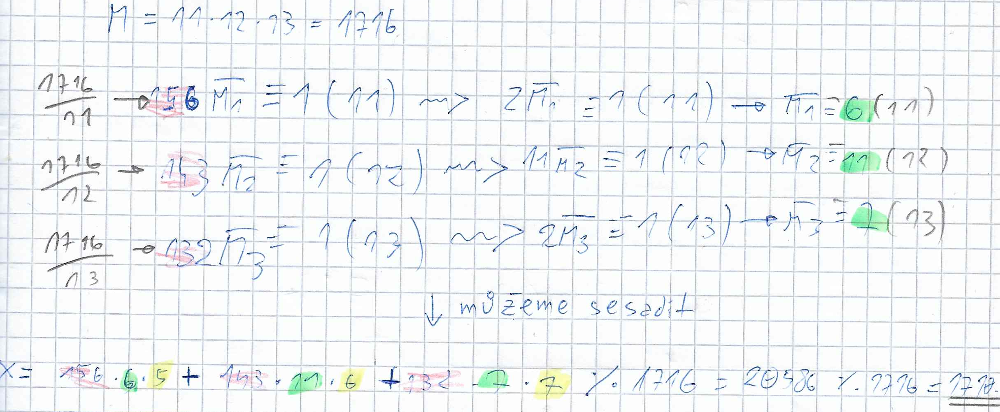

# Kongruence a Čínská věta o zbytku

## Kongruence 1. stupně

Kongruence 1. stupně jsou ve tvaru 𝑎𝑥 ≡ 𝑏 (𝑚) a říkají, že 𝑎𝑥 a 𝑏 vrací po vydělení číslem 𝑚 stejný zbytek. Pro představu může být lepší formulace, že 𝑎𝑥 a 𝑏 se od sebe liší o nějaký násobek čísla 𝑚.

O řešení kongruencí platí následující:

* `𝑑 = NSD(𝑎,𝑚)`
  * `𝑑 = 1` – právě jedno řešení
  * `𝑑 ≠ 1 ∧ 𝑑|𝑏` – 𝑑-násobné řešení
  * `𝑑 ≠ 1 ∧ 𝑑∤𝑏` – nemá řešení

Postup výpočtu:

* __1.__ Otestovat řešitelnost
* __2.__ Zjednodušit
  * __2a.__ Při 𝑑-násobném řešení je nutné celou rovnici vydělit 𝑑 (levá strana, pravá strana, modulo)
  * __2b.__ Z levé a/nebo pravé strany odebrat největší násobek modulu (pro jednonásobné i vícenásobné řešení)
* __3.__ Vyplnit tabulku:

```text
╔═══╦════╦════╗
║ i ║ -2 ║ -1 ║
╠═══╬════╬════╣
║ Γ ║ m  ║ a  ║
╠═══╬════╩════╣
║ q ║         ║
╠═══╬════╦════╣
║ P ║ 0  ║ 1  ║
╚═══╩════╩════╝
```

* V tabulce:
  * `i` je inkrementováno s každým sloupcem
  * `m` a `a` je získáno ze (zjednodušeného) zadání
  * 𝑞<sub>𝑖</sub> je celá část výsledku a Γ<sub>𝑖</sub> je zbytek po dělení Γ<sub>𝑖-2</sub>/Γ<sub>𝑖-1</sub>
  * 𝑃<sub>𝑖</sub> = 𝑞<sub>𝑖</sub> ⋅ 𝑃<sub>𝑖-1</sub> + 𝑃<sub>𝑖-2</sub>
* __4.__ Dosadit hodnoty z tabulky do vzorce 𝑥 = (-1)<sup>𝑛</sup> ⋅ 𝑃<sub>𝑛-1</sub> ⋅ 𝑏
  * Za 𝑛 považujeme poslední hodnotu v řádku `i`
  * 𝑃<sub>𝑛-1</sub> je tedy předposlední hodnota v řádku `P`
* __5.__ U 𝑑-násobného řešení přičítat k 𝑥 vydělený modul, dokud jich není 𝑑
  * Řešení jsou modulována původním modulem (takže pokud budeme přičítat dále, zacyklíme se)
* __Kongruence má vždy 0 až 𝑚 řešení, ale vyhovuje jí buď 0, nebo nekonečno čísel__ (viz příklad)

### Příklad kongruence 1. stupně (jednonásobné řešení)

1143𝑥 ≡ 22 (500)

* __1.__ Otestujeme řešitelnost: `𝑑 = NSD(1143,500) = 1` ⇒ má právě jedno řešení
* __2b.__ Zjednodušíme levou stranu – odebereme největší násobek modulu:

```text
         1143𝑥 ≡ 22 (500)
(2×500 + 143)𝑥 ≡ 22 (500)
          143𝑥 ≡ 22 (500)
```

* __3.__ Vyplníme tabulku:

```text
╔═══╦═════╦═════╗     ╔═══╦═════╦═════╦════╦════╦═════╗     ╔═══╦═════╦═════╦════╦════╦═════╗
║ i ║  -2 ║  -1 ║     ║ i ║  -2 ║  -1 ║  0 ║  1 ║   2 ║     ║ i ║  -2 ║  -1 ║  0 ║  1 ║   2 ║ ← 𝑛 = 2
╠═══╬═════╬═════╣     ╠═══╬═════╬═════╬════╬════╬═════╣     ╠═══╬═════╬═════╬════╬════╬═════╣
║ Γ ║ 500 ║ 143 ║     ║ Γ ║ 500 ║ 143 ║ 71 ║  1 ║   0 ║     ║ Γ ║ 500 ║ 143 ║ 71 ║  1 ║   0 ║
╠═══╬═════╩═════╣  →  ╠═══╬═════╩═════╬════╬════╬═════╣  →  ╠═══╬═════╩═════╬════╬════╬═════╣
║ q ║           ║     ║ q ║           ║  3 ║  2 ║  71 ║     ║ q ║           ║  3 ║  2 ║  71 ║
╠═══╬═════╦═════╣     ╠═══╬═════╦═════╬════╬════╬═════╣     ╠═══╬═════╦═════╬════╬════╬═════╣
║ P ║   0 ║   1 ║     ║ P ║   0 ║   1 ║    ║    ║     ║     ║ P ║   0 ║   1 ║  3 ║  7 ║ 500 ║
╚═══╩═════╩═════╝     ╚═══╩═════╩═════╩════╩════╩═════╝     ╚═══╩═════╩═════╩════╩════╩═════╝
                                                                                    ↑ 𝑃ₙ₋₁ = 7
```

* __4.__ Dosadíme do vzorce 𝑥 = (-1)<sup>𝑛</sup> ⋅ 𝑃<sub>𝑛-1</sub> ⋅ 𝑏

```text
𝑥 = (-1)² ⋅ 7 ⋅ 22
𝑥 = 154

Kongruence má jedno řešení, ale vyhovuje jí nekonečno čísel!
Korektní výsledek rovnice 1143 ⋅ 𝑥 ≡ 22 (500) je tedy 𝑥 ≡ 154 (500).
```

* __𝑥 ≡ 154 (500)__

### Příklad kongruence 1. stupně (vícenásobné řešení)

768𝑥 ≡ -1240 (412)

* __1.__ Otestujeme řešitelnost: `𝑑 = NSD(768,412) = 4` ⇒ má 4 řešení
* __2a.__ Rovnici je nutné vydělit čtyřkou: `192𝑥 ≡ -310 (103)`
* __2b.__ Zjednodušíme strany:

```text
         192𝑥 ≡ -310         (103)
(1×103 + 89)𝑥 ≡ -(3×103 + 1) (103)
          89𝑥 ≡ -1           (103)
```

* __3.__ Vyplníme tabulku:

```text
i     -2      -1       0       1       2       3       4
Γ    103      89      14       5       4       1       0
q                      1       6       2       1       4
P      0       1       1       7      15      22     103
```

* __4.__ Dosadíme do vzorce 𝑥 = (-1)<sup>𝑛</sup> ⋅ 𝑃<sub>𝑛-1</sub> ⋅ 𝑏

```text
𝑥 = (-1)⁴ ⋅ 22 ⋅ -1
𝑥 = -22 (mod 103)
𝑥 =  81 (mod 103)
```

* __5.__ Řešení původní kongruence je čtyřnásobné
  * Řešení vydělené kongruence použijeme pro „generaci“ řešení v původním modulu
  * `𝑥 = 81 (mod 103)` ⇒ `𝑥 = 81 + 103𝑛 (mod 412)`

```text
81 + 103(0) =  81 (mod 412)
81 + 103(1) = 184 (mod 412)
81 + 103(2) = 287 (mod 412)
81 + 103(3) = 390 (mod 412)
𝑥 = {81, 184, 287, 390}

Kongruence má čtyři řešení, ale vyhovuje jí nekonečno čísel!
Korektní výsledek rovnice 768𝑥 ≡ -1240 (412) je tedy:
```

* __𝑥 = {81 + 𝑘𝑚, 184 + 𝑘𝑚, 287 + 𝑘𝑚, 390 + 𝑘𝑚}, kde (𝑚 = 412) ∧ (𝑘 ∈ ℤ)__

### Kongruence bruteforce

* Do kalkulačky napíšeme `(𝑎 × 𝑥 - 𝑏) ÷ 𝑚`
* Za 𝑥 postupně dosazujeme čísla 0 až 𝑚-1
* Pokud nám vyjde výsledek beze zbytku, pak je 𝑥 řešením kongruence
* (Použitelné pro menší moduly)

## Soustavy kongruencí 1. stupně

* Uvažujeme soustavu kongruencí tvaru:
  * 𝑥 ≡ 𝑏₁ (𝑚₁)
  * 𝑥 ≡ 𝑏₂ (𝑚₂)
  * ...
  * 𝑥 ≡ 𝑏<sub>𝑘</sub> (𝑚<sub>𝑘</sub>)
* Jednotlivé kongruence jsou tedy tvaru 𝑎𝑥 ≡ 𝑏 (𝑚), kde 𝑎 = 1
* Hledáme jejich společné řešení

### Úprava do tvaru 𝑎 = 1

* Co s kongruencí, kde 𝑎 ≠ 1? Např.:
  * `21𝑥 ≡ 84 (45)`
* Nejprve z levé a/nebo pravé strany odebereme největší násobek modulu:
  * `21𝑥 ≡ 84 (45)` → `21𝑥 ≡ 45 + 39 (45)` → `21𝑥 ≡ 39 (45)`
* Pokud NSN(𝑎,𝑏,𝑚) ≠ 1, tak jím celou kongruenci vydělíme:
  * `21𝑥 ≡ 39 (45)` → `7𝑥 ≡ 13 (15)`
* Nyní máme `7𝑥 ≡ 13 (15)` a na levé straně potřebujeme samotné 𝑥:
  * Hledáme číslo, které po vynásobení 7 a modulo 15 dá 1 (inverzní prvek k číslu 7 v ℤ<sub>15</sub>)
  * Řešíme tedy kongruenci `7𝑥 ≡ 1 (15)` → `𝑥 ≡ 13 (15)`
* Vynásobíme levou a pravou stranu inverzním prvkem:
  * `7𝑥 ⋅ 13 ≡ 13 ⋅ 13 (15)` → `91𝑥 ≡ 169 (15)` → `𝑥 ≡ 4 (15)`

### Čínská věta o zbytku

Čínskou větu o zbytku lze použít tehdy, pokud jsou jednotlivé moduly kongruencí po dvou nesoudělné (∀𝑖≠𝑗 NSD(𝑚<sub>𝑖</sub>,𝑚<sub>𝑗</sub>)=1). Pak má soustava pro libovolné pravé strany 𝑏₁, ..., 𝑏<sub>𝑘</sub> právě jedno řešení modulo 𝑀 = 𝑚₁ ⋅ ... ⋅ 𝑚<sub>𝑘</sub>. Toto řešení je tvaru:

𝑥 ≡ 𝑥₀ (mod 𝑀)<br>
𝑥₀ ≡ 𝑀₁<i>M̄</i>₁𝑏₁ + ... + 𝑀₁<sub>𝑘</sub>_M̄_<sub>𝑘</sub>𝑏<sub>𝑘</sub> (mod 𝑀)

kde ∀𝑖 platí (𝑀<sub>𝑖</sub> = 𝑀/𝑚<sub>𝑖</sub>) &ensp; ∧ &ensp; (𝑀<sub>𝑖</sub> ⋅ _M̄_<sub>𝑖</sub> ≡ 1 (𝑚<sub>𝑖</sub>))

```text
Najděte 𝑥 pro
𝑥 ≡ 5 (11)
𝑥 ≡ 6 (12)
𝑥 ≡ 7 (13)

Moduly 11, 12, 13 jsou po dvou nesoudělné ⇒ použijeme čínu
```



Korektní výsledek je tvaru:<br><b>
𝑥 ≡ 𝑥₀ (1716)<br>
𝑥₀ ≡ 1710 (1716)</b>

### Zobecněná čínská věta o zbytku

Zobecněnou čínskou větu o zbytku můžeme použít, pokud neplatí podmínka po dvou nesoudělných modulů, ale platí, že ∀𝑖≠𝑗 NSD(𝑚<sub>𝑖</sub>,𝑚<sub>𝑗</sub>)|(𝑏<sub>𝑖</sub> - 𝑏<sub>𝑗</sub>). Pak je jediné řešení soustavy tvaru:

𝑥 ≡ 𝑐₁ ⋅ 𝑏₁ + ... + 𝑐<sub>𝑘</sub> ⋅ 𝑏<sub>𝑘</sub> (mod 𝑀)

* __𝑀__ = NSN(𝑚₁, ..., 𝑚<sub>𝑘</sub>)

* __𝑐<sub>𝑖</sub>__ (pro 𝑖 = 1, ..., 𝑘) jsou taková čísla, že:

  * (𝑐<sub>𝑖</sub> ≡ 0 (𝑀/𝑑<sub>𝑖</sub>)) &ensp; ∧ &ensp; (𝑐<sub>𝑖</sub> ≡ 1 (𝑑<sub>𝑖</sub>))
  * ⇒  (𝑀/𝑑<sub>𝑖</sub>)𝑡 ≡ 1 (𝑑<sub>𝑖</sub>) &ensp; ⇔ &ensp; 𝑐<sub>𝑖</sub> = (𝑀/𝑑<sub>𝑖</sub>)𝑡

* __𝑑<sub>𝑖</sub>__ (pro 𝑖 = 1, ..., 𝑘) jsou taková čísla, že:

  * (∀𝑖≠𝑗 NSD(𝑑<sub>𝑖</sub>,𝑑<sub>𝑗</sub>) = 1) &ensp; ∧ &ensp; (∀𝑖 𝑑<sub>𝑖</sub>|𝑚<sub>𝑖</sub>) &ensp; ∧ &ensp; (𝑑₁ ⋅ ... ⋅ 𝑑<sub>𝑘</sub> = 𝑀)
  * Déčka jsou po dvou nesoudělná, každé dělí svůj patřičný modul a jejich vynásobením dostaneme 𝑀

```text
Najděte 𝑥 pro
𝑥 ≡ 6 (12)
𝑥 ≡ 2 (14)
𝑥 ≡ 3 (15)
𝑥 ≡ 9 (21)

Moduly 12, 14, 15, 21 nejsou po dvou nesoudělné (např. 12 a 14 jsou soudělné) ⇒ použijeme zobecněnou čínu

Nutná a postačující podmínka platnosti řešení: ∀i≠j NSD(𝑚ᵢ,𝑚ⱼ)|𝑏ᵢ-𝑏ⱼ, využíváme 𝑎|𝑏 ⇒ ±𝑎|±𝑏:
NSD(𝑚₁,𝑚₂)|𝑏₁-𝑏₂ → NSD(12,14)|6-2 → 2|4 ✔
NSD(𝑚₁,𝑚₃)|𝑏₁-𝑏₃ → NSD(12,15)|6-3 → 3|3 ✔
NSD(𝑚₁,𝑚₄)|𝑏₁-𝑏₄ → NSD(12,21)|6-9 → 3|3 ✔
NSD(𝑚₂,𝑚₃)|𝑏₂-𝑏₃ → NSD(14,15)|2-3 → 1|1 ✔
NSD(𝑚₂,𝑚₄)|𝑏₂-𝑏₄ → NSD(14,21)|2-9 → 7|7 ✔
NSD(𝑚₃,𝑚₄)|𝑏₃-𝑏₄ → NSD(15,21)|3-9 → 3|6 ✔
⇒ Soustava má řešení
```


Korektní výsledek je tvaru:<br><b>
𝑥 ≡ 198 (420)</b>
