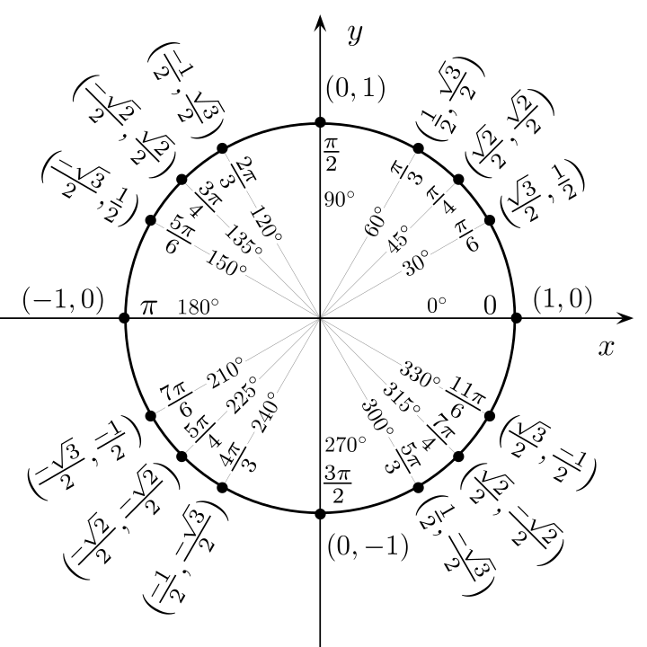

# Přehled goniometrických funkcí

 

Sinus|&ensp; &ensp; &ensp; &ensp; &ensp; &ensp; &ensp; &ensp; &ensp; &ensp;|Arkus sinus
:-:|---|:-:
||

 

Kosinus|&ensp; &ensp; &ensp; &ensp; &ensp; &ensp; &ensp; &ensp; &ensp; &ensp;|Arkus kosinus
:-:|---|:-:
||

 

Tangens|&ensp; &ensp; &ensp; &ensp; &ensp; &ensp; &ensp; &ensp; &ensp; &ensp;|Arkus tangens
:-:|---|:-:
||

 

Kotangens|&ensp; &ensp; &ensp; &ensp; &ensp; &ensp; &ensp; &ensp; &ensp; &ensp;|Arkus kotangens
:-:|---|:-:
||

 

 

<table>
    <thead>
        <tr><th align="center" rowspan="2"><i>x</i></th><th align="center">0</th><th align="center">π/6</th><th align="center">π/4</th><th align="center">π/3</th><th align="center">π/2</th></tr>
        <tr><th align="center">0°</th><th align="center">30°</th><th align="center">45°</th><th align="center">60°</th><th align="center">90°</th></tr>
    </thead>
    <tbody>
        <tr><td align="center" rowspan="2">sin <i>x</i></td><td align="center">√0/2</td><td align="center">√1/2</td><td align="center">√2/2</td><td align="center">√3/2</td><td align="center">√4/2</td></tr>
        <tr></td><td align="center">0</td><td align="center">1/2</td><td align="center">√2/2</td><td align="center">√3/2</td><td align="center">1</td></tr>
    </tbody>
</table>

 

<!--
sin
$$
\begin{align*}
D_{\sin}&=ℝ \\
H_{\sin}&=\langle-1;1\rangle \\
\\
(\sin{x})'&=\cos{x} \\
\int \! \sin{x} \, \mathrm{d}x&=-\cos{x}+c \\
\\
\sin{(2x)}&=2\sin{x}\cos{x}
\end{align*}
$$
cos
$$
\begin{align*}
D_{\cos}&=ℝ \\
H_{\cos}&=\langle-1;1\rangle \\
\\
(\cos{x})'&=-\sin{x} \\
\int \! \cos{x} \, \mathrm{d}x&=\sin{x}+c \\
\\
\cos{(2x)}&=\cos^2{x}-\sin^2{x} \\
1&=\sin^2{x}+\cos^2{x}
\end{align*}
$$
tg
$$
\begin{align*}
D_{\mathrm{tg}}&=ℝ \smallsetminus \left\{ \frac{\pi}{2}+k\pi \right\} \\
H_{\mathrm{tg}}&=ℝ \\
\\
(\mathrm{tg}\ x)'&=\frac{1}{\cos^2{x}} \\
\\
\mathrm{tg}\ x&=\frac{\sin{x}}{\cos{x}}
\end{align*}
$$
cotg
$$
\begin{align*}
D_{\mathrm{cotg}}&=ℝ \smallsetminus \{ k\pi \} \\
H_{\mathrm{cotg}}&=ℝ \\
\\
(\mathrm{cotg}\ x)'&=\frac{-1}{\sin^2{x}} \\
\\
\mathrm{cotg}\ x&=\frac{\cos{x}}{\sin{x}}
\end{align*}
$$
arcsin
$$
\begin{align*}
D_{\arcsin}&=\langle-1;1\rangle \\
H_{\arcsin}&=\left\langle -\frac{\pi}{2};\frac{\pi}{2} \right\rangle \\
\\
(\arcsin{x})'&=\frac{1}{\sqrt{1-x^2}}
\end{align*}
$$
arccos
$$
\begin{align*}
D_{\arccos}&=\langle-1;1\rangle \\
H_{\arccos}&=\langle 0;\pi \rangle \\
\\
(\arccos{x})'&=\frac{-1}{\sqrt{1-x^2}}
\end{align*}
$$
arctg
$$
\begin{align*}
D_{\mathrm{arctg}}&=ℝ \\
H_{\mathrm{arctg}}&=\left(-\frac{\pi}{2};\frac{\pi}{2}\right) \\
\\
(\mathrm{arctg}\ x)'&=\frac{1}{1+x^2}
\end{align*}
$$
arccotg
$$
\begin{align*}
D_{\mathrm{arccotg}}&=ℝ \\
H_{\mathrm{arccotg}}&=(0;\pi) \\
\\
(\mathrm{arccotg}\ x)'&=\frac{-1}{1+x^2}
\end{align*}
$$
-->
